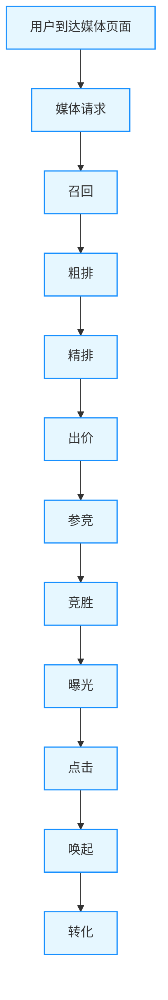

**一个广告请求的整体流程**：用户到达媒体页面 -> 媒体请求 -> 召回 -> 粗排 -> 精排 -> 出价 -> 参竞 -> 竞胜 -> 曝光 -> 点击 -> 唤起 -> 转化 。
广告请求的整体流程可以用一个漏斗图表示，如下：

```mermaid
graph TD
    A[用户到达媒体页面] --> B[媒体请求]
    B --> C[召回]
    C --> D[粗排]
    D --> E[精排]
    E --> F[出价]
    F --> G[参竞]
    G --> H[竞胜]
    H --> I[曝光]
    I --> J[点击]
    J --> K[唤起]
    K --> L[转化]

    %% 样式优化：统一边框和填充色，突出流程连贯性
    style A fill:#e6f7ff,stroke:#1890ff,stroke-width:1.5px
    style B fill:#e6f7ff,stroke:#1890ff,stroke-width:1.5px
    style C fill:#e6f7ff,stroke:#1890ff,stroke-width:1.5px
    style D fill:#e6f7ff,stroke:#1890ff,stroke-width:1.5px
    style E fill:#e6f7ff,stroke:#1890ff,stroke-width:1.5px
    style F fill:#e6f7ff,stroke:#1890ff,stroke-width:1.5px
    style G fill:#e6f7ff,stroke:#1890ff,stroke-width:1.5px
    style H fill:#e6f7ff,stroke:#1890ff,stroke-width:1.5px
    style I fill:#e6f7ff,stroke:#1890ff,stroke-width:1.5px
    style J fill:#e6f7ff,stroke:#1890ff,stroke-width:1.5px
    style K fill:#e6f7ff,stroke:#1890ff,stroke-width:1.5px
    style L fill:#e6f7ff,stroke:#1890ff,stroke-width:1.5px
```
在整个流程中，涉及媒体、广告平台、广告主等多个角色，每个角色都有不同的职责和权利，各个角色之间利益不同，充满博弈。